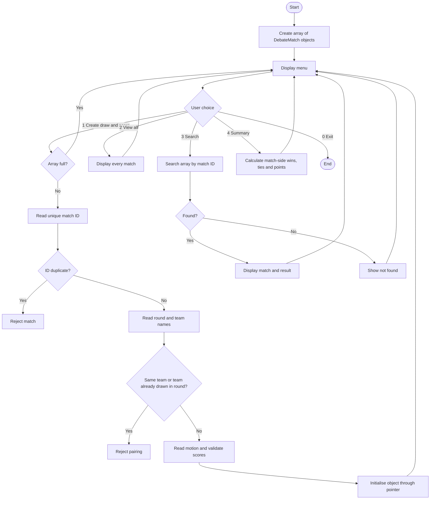

# Program Flowchart — CA1

```mermaid
flowchart TD
    A([Start]) --> B[Create array of DebateMatch objects]
    B --> C[Display menu]
    C --> D{User choice}
    D -->|1 Create draw and score| E{Array full?}
    E -->|Yes| C
    E -->|No| F[Read unique match ID]
    F --> G{ID duplicate?}
    G -->|Yes| H[Reject match]
    G -->|No| I[Read round and team names]
    I --> J{Same team or team already drawn in round?}
    J -->|Yes| K[Reject pairing]
    J -->|No| L[Read motion and validate scores]
    L --> M[Initialise object through pointer]
    M --> C
    D -->|2 View all| N[Display every match]
    N --> C
    D -->|3 Search| O[Search array by match ID]
    O --> P{Found?}
    P -->|Yes| Q[Display match and result]
    P -->|No| R[Show not found]
    Q --> C
    R --> C
    D -->|4 Summary| S[Calculate match-side wins, ties and points]
    S --> C
    D -->|0 Exit| T([End])
```
