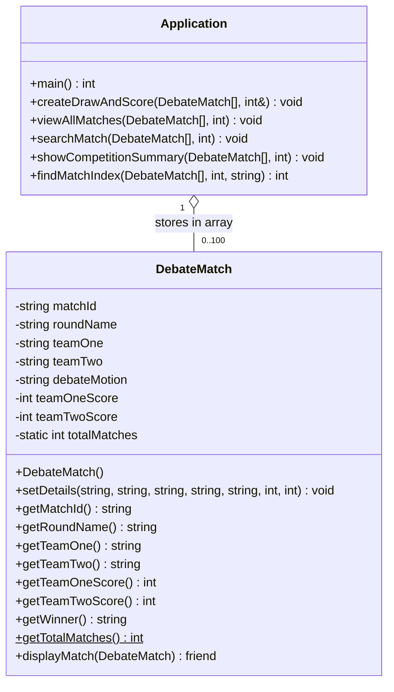

# UML Class Diagram — CA1

```mermaid
classDiagram
    class DebateMatch {
        -string matchId
        -string roundName
        -string teamOne
        -string teamTwo
        -string debateMotion
        -int teamOneScore
        -int teamTwoScore
        -static int totalMatches
        +DebateMatch()
        +setDetails(string, string, string, string, string, int, int) void
        +getMatchId() string
        +getRoundName() string
        +getTeamOne() string
        +getTeamTwo() string
        +getTeamOneScore() int
        +getTeamTwoScore() int
        +getWinner() string
        +getTotalMatches()$ int
        +displayMatch(DebateMatch) friend
    }
    class Application {
        +main() int
        +createDrawAndScore(DebateMatch[], int&) void
        +viewAllMatches(DebateMatch[], int) void
        +searchMatch(DebateMatch[], int) void
        +showCompetitionSummary(DebateMatch[], int) void
        +findMatchIndex(DebateMatch[], int, string) int
    }
    Application "1" o-- "0..100" DebateMatch : stores in array
```

`displayMatch` is a non-member friend function. Application functions operate on the array of `DebateMatch` objects.
